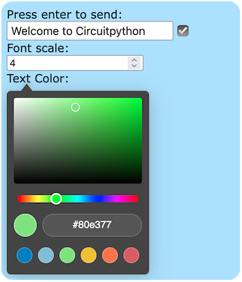

# circuitpython_http_text_to_display
A web page to set a text, including size and color, on a builtin display.

Dependencies:
```
adafruit_httpserver
adafruit_display_text
```

Code tested on PyPortal and FunHouse.
Other boards might require pin settings.
External displays will require setting the display.

Universal Socket required for airlift compatibility, from the repository: https://github.com/Neradoc/Circuitpython_Universal_Sockets



